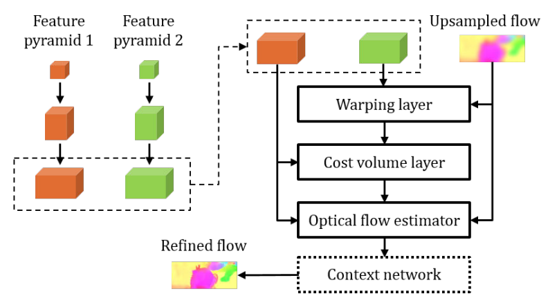
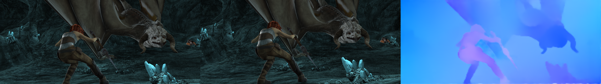

**Status**: the codes implemented by 'tf.compat.v1' still under testing.

# pwcnet-tf2
This repository provides the TensorFlow implementation of for paper ["PWC-Net: CNNs for Optical Flow Using Pyramid, Warping, and Cost Volume"](https://arxiv.org/abs/1709.02371.pdf), which was presented in CVPR'18 (Oral). 



I implemented the latest version "PWCDC-Net" of PWCNet in both **TensorFlow 2.0** and **TensorFlow 1.0 (based on "tf.compat.v1")**, so that you can easily compare the difference between tf 2.x and tf 1.x. The codes for tf 2.x version are modified and inherited from the [official pytorch version](https://github.com/NVlabs/PWC-Net/tree/master/PyTorch), while the codes for tf 1.x are implemented in a different way.

## Quick Start 
### Install dependency 
The codes are test on `Python 3.7`. Please run the following script to install the packages.
```bash
pip install -r requirements.txt
```

### Download pretrained model
Run the following script to download the provided pretrained model from Google Drive.
```bash
./download_models.sh
```
Or directly get the pretrained model from [Google Drive](https://drive.google.com/file/d/1BV1oTmBG8ezWeePfb0es1TSuHRyvGt3t/view?usp=sharing).

### Run Inference
Run the following sample command for inference
```
python inference.py --image_0 sample_images/00003_img1.ppm --image_1 sample_images/00003_img2.ppm \
--ckpt_path ./checkpoints/ckpt-1200000 
```
Then you will see an output file generated.

## Other Usages
### TF 2.x
```bash
# Training
python train.py --data_dir $DATASET_ROOT_DIR --model_dir ./checkpoints \
--random_scale --random_flip

# Evaluation on FlyingChairs dataset
python evaluate.py --data_dir $DATASET_ROOT_DIR --ckpt_path ./checkpoints/ckpt-1200000 \
--val_list ./list/FlyingChairs_val_list.txt

# Evaluation on MPI Sintel dataset
python evaluate.py --data_dir $DATASET_ROOT_DIR --ckpt_path ./checkpoints/ckpt-1200000 \
--val_list ./list/MPI_Sintel_Clean_train_list.txt
```

### TF 2.x + tf.compat.v1
> Have not tested yet.

```bash
python train_v1_compat.py --data_dir $DATASET_ROOT_DIR --model_dir ./checkpoints \
--random_scale --random_flip
```

## Results on validation set 
The [checkpoint](./checkpoints) is trained on the mixture of FlyingChairs and FlyingThings3D-HalfRes dataset (see the [description](#mixed-dataset) here). Please note that this checkpoint has not been fine-tuned on MPI Sintel dataset yet.

For your information,
- Training from scratch with **batch size 8** on **TitanV** takes about **4-5 days**. 
- Training from scratch with **batch size 32** on **V100** takes about **2-3 days**.

### Average End Point Error (AEPE) 

| FlyingChairs | MPI Sintel Clean (train set) | MPI Sintel Final (train set) |
|:----:|:----:|:-----:|
| 1.716 | 2.852 | 3.988 |

### Optical Flow Prediction
#### FlyingChairs


#### MPI Sintel


### Inference time
| Dataset | TitanV |
|:----:|:----:|
| FlyingChairs (384x512) | 0.026 sec | 
| MPI Sintel (436x1024) | 0.038 sec |

## File hierarchy
To use the pre-generated list for training and validation, you need to download and put the datasets as following hierarchy:
```
- Datasets ($DATASET_ROOT_DIR)
  - FlyingChairs_release
    - data
  - FlyingThings3D
    - frames_cleanpass
    - optical_flow
  - MPI_Sintel
    - training
    - test
```

You can download the related datasets from 
- FlyingChairs - [images pairs + flows](https://lmb.informatik.uni-freiburg.de/data/FlyingChairs/FlyingChairs.zip)
- FlyingThings3D - [image pairs](https://lmb.informatik.uni-freiburg.de/data/SceneFlowDatasets_CVPR16/Release_april16/data/FlyingThings3D/raw_data/flyingthings3d__frames_cleanpass.tar) + [flows](https://lmb.informatik.uni-freiburg.de/data/SceneFlowDatasets_CVPR16/Release_april16/data/FlyingThings3D/derived_data/flyingthings3d__optical_flow.tar.bz2)
- MPI_Sintel - [images pairs + flows (European mirror)](http://files.is.tue.mpg.de/sintel/MPI-Sintel-complete.zip) or [images pairs + flows (US mirror)](http://sintel.cs.washington.edu/MPI-Sintel-complete.zip)

## Clarification of implementation details
### Mixed-use of 'FlyingChairs' and 'FlyingThings3D-Half-Res' datasets. <a name="mixed-dataset"></a>
> "We got more stable results by using a half-resolution version of the FlyingThings3D dataset with an average flow magnitude of 19, much closer to FlyingChairs and MPI-Sintel in that respect. We then trained on a mix of the FlyingChairs and FlyingThings3DHalfRes datasets. This mix, of course, could be extended with additional datasets.", as refered to the [explaination](https://github.com/philferriere/tfoptflow#multisteps-learning-rate-schedule-) by Philferriere.

Thus, in this implementation we trained on the mixed dataset as suggested. 

Please see this [issue](https://github.com/NVlabs/PWC-Net/issues/44) in the official released repository and the [explaination](https://github.com/philferriere/tfoptflow#multisteps-learning-rate-schedule-) here for further details.

### We scale the supervision signal at each level, which is different from the official version.
>  "We scale the ground truth flow by 20 and downsample it to obtain the supervision signals at different levels. Note that we do not further scale the supervision signal at each level.", as refered to Sec. 4 in the original paper.

I have tried to implement the loss function as decribed above, however, it seems that the training loss cannot converge. Instead, I refer to this [implementation](https://github.com/philferriere/tfoptflow) for the design of loss function: (1) rescale the supervision signals and (2) still scale the estimated optical flow before warping function. Please note that the flow scale in each level can be learned and adjusted by transposed layers.

### Cannot always converge with 'FlyingChairs' and 'FlyingThings3D' datasets.
>  "However, we observe in our experiments that a deeper optical flow estimator mightget stuck at poor local minima, which can be detected by checking the validation errors after a few thousand iterations and fixed by running from a different random initialization.", as refered to Sec. 4-2 in the original paper.

I also encountered this problem for several times. The solution is to check the validation AEPE to see if the AEPE is decreasing or not. If not, you need to restart the whole training process. In general, the problem can be detected before 8000 steps.

## Acknowledment & Reference
- [PWC-Net (Official released version)](https://github.com/NVlabs/PWC-Net) by NVlabs.
- [tfoptflow](https://github.com/philferriere/tfoptflow) by philferriere.
- [pwcnet](https://github.com/daigo0927/pwcnet) by daigo0927

## Citation
```
@InProceedings{Sun2018PWC-Net,
  author    = {Deqing Sun and Xiaodong Yang and Ming-Yu Liu and Jan Kautz},
  title     = {{PWC-Net}: {CNNs} for Optical Flow Using Pyramid, Warping, and Cost Volume},
  booktitle = CVPR,
  year      = {2018},
}
```

If you find this implementation or the pre-trained models helpful, please consider to cite:
```
@misc{Yang2020,
  author = {Hsuan-Kung, Yang},
  title = {PWCNet-tf2},
  year = {2020},
  publisher = {GitHub},
  journal = {GitHub repository},
  howpublished = {\url{https://github.com/hellochick/PWCNet-tf2}}
}
```
